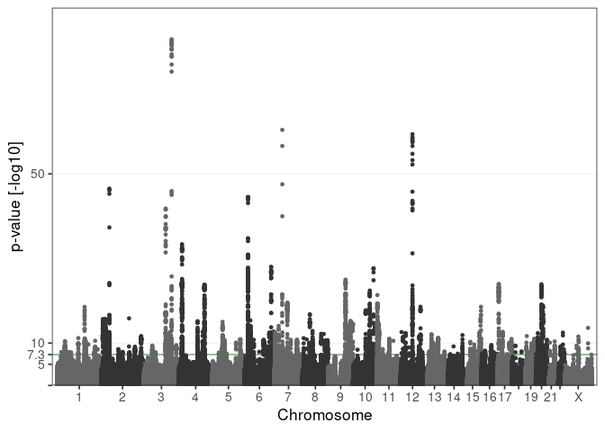
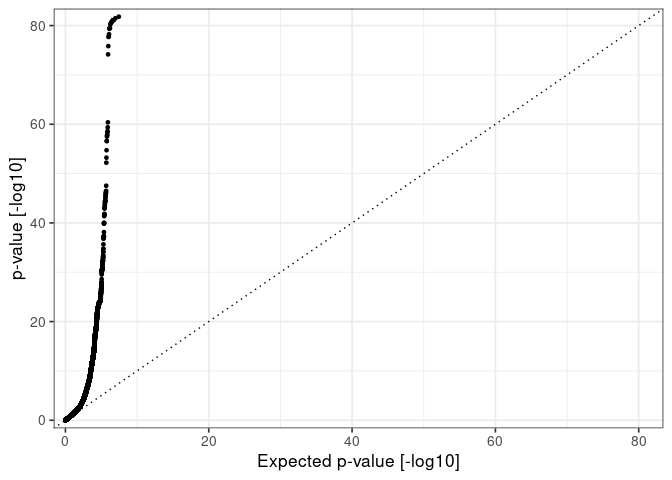
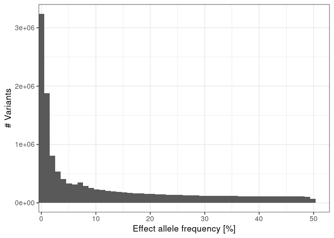
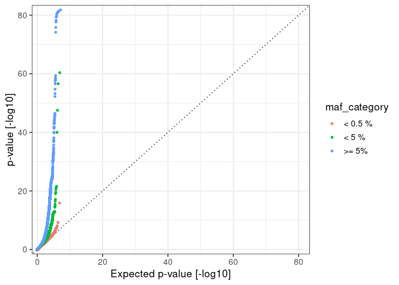
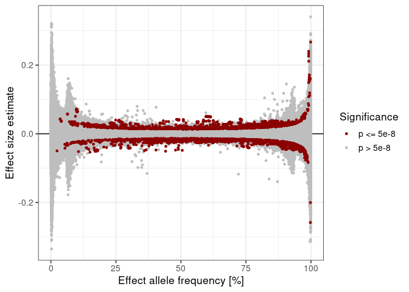

## Inspecting GWAS summary statistics

This notebook provides and introduction to inspecting the results of
genome-wide association studies.

## Libraries

We will need the following libraries. If they are not availble on your
system, use the `ìnstall_packages` command to install them.

    library(janitor) # A package to clean dirty data

    ## 
    ## Attaching package: 'janitor'

    ## The following objects are masked from 'package:stats':
    ## 
    ##     chisq.test, fisher.test

    library(tidyr) # A package to tidy data
    library(dplyr) # A package to manipulate data

    ## 
    ## Attaching package: 'dplyr'

    ## The following objects are masked from 'package:stats':
    ## 
    ##     filter, lag

    ## The following objects are masked from 'package:base':
    ## 
    ##     intersect, setdiff, setequal, union

    library(parallel) # A package to run tasks in parallel
    library(glue) # A package to glue variables in strings

    library(ggplot2) # A package to plot data

    library(conflicted) # A package to manage namespace conflicts

    # Resolve conflicting function names
    conflict_prefer("filter", "dplyr")

    ## [conflicted] Will prefer dplyr::filter over any other package

    # Set the theme for plots
    theme_set(theme_bw(base_size = 13))

## Inspecting GWAS summary statistics

Load results from the birth weight GWAS available at this
[link](https://drive.google.com/file/d/1mn64G91258pDdDARVAS1cYlcof-Knu2n/view?usp=sharing).

    file_path <- "/home/marc/Projects/tutorials/data/Fetal_BW_European_meta.NG2019.txt.gz"

    gwas_results <- read.table(
      file = file_path,
      header = T,
      sep = " ",
      stringsAsFactors = F
    ) %>% 
      clean_names()

*Do you understand the meaning of the different columns? Is there
anything that you find surprising?*

Build a Manhattan plot. Note: there are dedicated packages that can do
this but for the sake of the exercise we will write down the code.

    # Chromosome lengths in GRCh37.p13 (hg19) from Ensembl

    chromosomes <- c("1", "2", "3", "4", "5", "6", "7", "8", "9", "10", "11", "12", "13", "14", "15", "16", "17", "18", "19", "20", "21", "22", "X")
    chromosomeLength <- c(249250621, 243199373, 198022430, 191154276, 180915260, 171115067, 159138663, 146364022, 141213431, 135534747, 135006516, 133851895, 115169878, 107349540, 102531392, 90354753, 81195210, 78077248, 59128983, 63025520, 48129895, 51304566,    155270560)
    genomeLength <- sum(chromosomeLength)
    chromosomeStart <- cumsum(chromosomeLength) - chromosomeLength
    chromosomeMiddle <- chromosomeStart + chromosomeLength / 2

    # Arrange for plotting

    plot_data <- gwas_results %>%
      mutate(
        logP = -log10(p)
      ) %>% 
      arrange(
        logP
      ) %>%
      mutate(
        chromosomeNumber = as.numeric(ifelse(chr == 'X', 23, chr)),
        x = chromosomeStart[chromosomeNumber] + pos,
        color = factor(chromosomeNumber %% 2, levels = 0:1)
      ) %>%
      arrange(
        chromosomeNumber, logP, pos
      )

    maxP <- max(plot_data$logP)

    # Colors

    mhColor1 <- "grey20"
    mhColor2 <- "grey40"
    colors <- c(mhColor1, mhColor2)

    # Chromosome labels

    xLabels <- 1:22
    xLabels[xLabels %% 2 == 0 & xLabels > 17] <- ""
    xLabels <- c(xLabels, "X")

    # y axis

    maxY <- 5 * ceiling(max(plot_data$logP / 5))
    maxY <- max(maxY, 10)

    yBreaks <- c(0, 5, -log10(5e-8))
    yLabels <- c("", 5, round(-log10(5e-8), digits = 1))

    lastBreak <- floor(max(maxY / 10))

    if (lastBreak > 0) {
      
      newBreaks <- 10*(1:lastBreak)
      
      while(length(newBreaks) > 3) {
        
        newBreaks <- newBreaks[c(T, F)]
        
      }
      
      yBreaks <- c(yBreaks, newBreaks)
      yLabels <- c(yLabels, round(newBreaks, digits = 1))
      
    }

    # Build plot
    ggplot(
      data = plot_data
    ) + 
      geom_hline(
        yintercept = -log10(5e-8), 
        col = "green4", 
        size = 0.3
      ) + 
      geom_point(
        aes(
          x = x, 
          y = logP, 
          col = color
        ), 
        size = 1
      ) +
      scale_y_continuous(
        name = "p-value [-log10]", 
        breaks = yBreaks, 
        labels = yLabels, 
        expand = expansion(
          mult = c(0, 0.05)
        ), 
        limits = c(0, maxY)
      ) + 
      scale_x_continuous(
        name = "Chromosome", 
        breaks = chromosomeMiddle, 
        labels = xLabels, 
        limits = c(0, genomeLength), 
        expand = expansion(
          mult = 0.01
        )
      ) + 
      scale_color_manual(
        values = colors
      ) + 
      theme(
        legend.position = "none",
        panel.grid.minor = element_blank(),
        panel.grid.major.x = element_blank(),
        panel.grid.major.y = element_line(size = 0.3),
        strip.background = element_rect(
          fill = "grey99"
        )
      )

Build a QQ plot. Note: there are dedicated packages that can do this but
for the sake of the exercise we will write down the code.

    # Compute expected p-values

    plot_data <- gwas_results %>%
      mutate(
        logP = -log10(p)
      ) %>% 
      arrange(
        logP
      ) %>% 
      mutate(
        expectedLogP = sort(-log10(ppoints(n = n())))
      )

    # Axis

    maxValue <- max(plot_data$logP, plot_data$expectedLogP, 10)

    # Build plot
    ggplot(
      data = plot_data
    ) + 
      geom_abline(
        slope = 1,
        intercept = 0,
        linetype = "dotted"
      ) +
      geom_point(
        mapping = aes(
          x = expectedLogP,
          y = logP
        ),
        size = 1
      ) +
      scale_y_continuous(
        name = "p-value [-log10]", 
        limits = c(0, maxValue),
        expand = expansion(
          mult = 0.02
        )
      ) +
      scale_x_continuous(
        name = "Expected p-value [-log10]",
        limits = c(0, maxValue),
        expand = expansion(
          mult = 0.02
        )
      )

Build a histogram of allele frequencies.

    # Compute the maf
    plot_data <- plot_data %>% 
      mutate(
        minor_allele_frequency = ifelse(eaf > 0.5, 1 - eaf, eaf)
      )

    # Build histogram
    ggplot(
      data = plot_data
    ) + 
      geom_histogram(
        mapping = aes(
          x = 100 * minor_allele_frequency,
        ),
        size = 1,
        bins = 50
      ) +
      scale_y_continuous(
        name = "# Variants"
      ) +
      scale_x_continuous(
        name = "Effect allele frequency [%]",
        expand = expansion(
          mult = c(0, 0.05)
        )
      )

This study included variants down to a minor allele frequency of 0.1 %.

Build some maf categories.

    # Compute the maf
    plot_data <- plot_data %>% 
      mutate(
        maf_category = case_when(
          minor_allele_frequency < 0.005 ~ "< 0.5 %",
          minor_allele_frequency < 0.05 ~ "< 5 %",
          T ~ ">= 5%"
        ),
        maf_category = factor(maf_category, levels = c("< 0.5 %", "< 5 %", ">= 5%"))
      )

    table(plot_data$maf_category)/nrow(plot_data)

    ## 
    ##   < 0.5 %     < 5 %     >= 5% 
    ## 0.2307666 0.2747280 0.4945054

Build a QQ plot stratifying the variants per maf category.

    # Compute expected p-values

    plot_data_stratified <- plot_data %>%
      group_by(
        maf_category
      ) %>% 
      arrange(
        logP
      ) %>% 
      mutate(
        expectedLogP = sort(-log10(ppoints(n = n())))
      ) %>% 
      ungroup()

    # Axis

    maxValue <- max(plot_data_stratified$logP, plot_data_stratified$expectedLogP, 10)

    # Build plot
    ggplot(
      data = plot_data_stratified
    ) + 
      geom_abline(
        slope = 1,
        intercept = 0,
        linetype = "dotted"
      ) +
      geom_point(
        mapping = aes(
          x = expectedLogP,
          y = logP,
          col = maf_category
        ),
        size = 1
      ) +
      scale_y_continuous(
        name = "p-value [-log10]", 
        limits = c(0, maxValue),
        expand = expansion(
          mult = 0.02
        )
      ) +
      scale_x_continuous(
        name = "Expected p-value [-log10]",
        limits = c(0, maxValue),
        expand = expansion(
          mult = 0.02
        )
      )

Plot the effect size estimate against the effect allele frequency.

    # Color the genome-wide significant hits differently

    plot_data <- plot_data %>% 
      mutate(
        gwas_significant = ifelse(p <= 5e-8, "p <= 5e-8", "p > 5e-8"),
        gwas_significant = factor(gwas_significant, levels = c("p <= 5e-8", "p > 5e-8"))
      )

    # Build plot
    ggplot(
      data = plot_data
    ) + 
      geom_hline(
        yintercept = 0
      ) +
      geom_point(
        mapping = aes(
          x = 100 * eaf,
          y = beta,
          col = gwas_significant
        ),
        size = 1
      ) +
      scale_y_continuous(
        name = "Effect size estimate"
      ) +
      scale_x_continuous(
        name = "Effect allele frequency [%]"
      ) +
      scale_color_manual(
        name = "Significance",
        values = c("darkred", "grey")
      )

