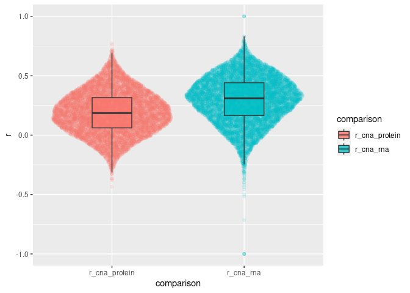
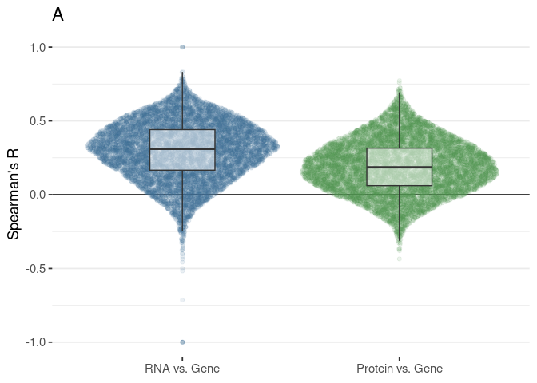
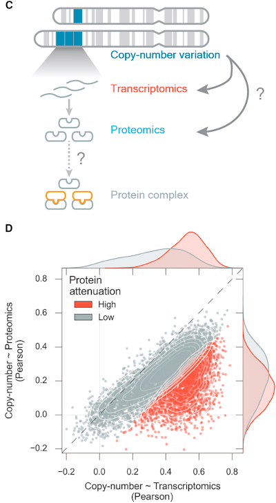
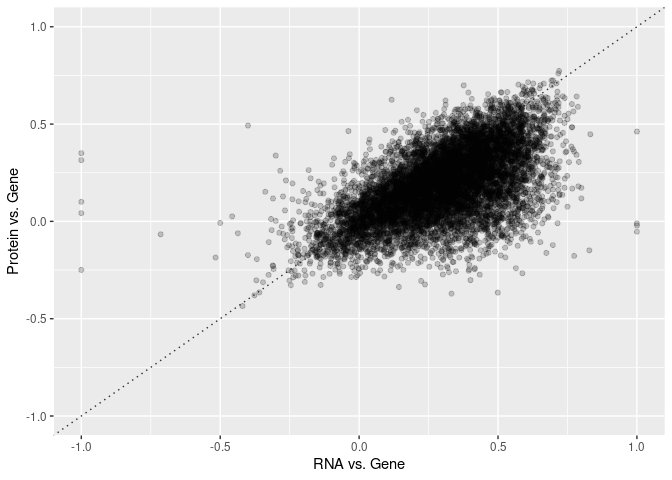
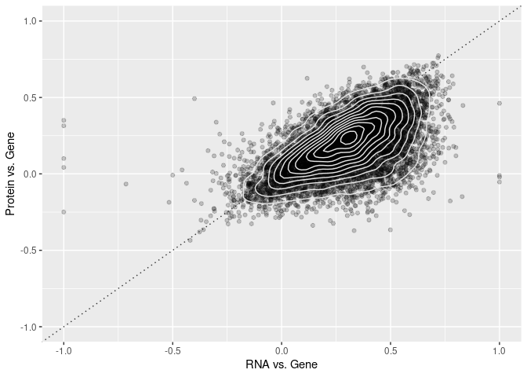
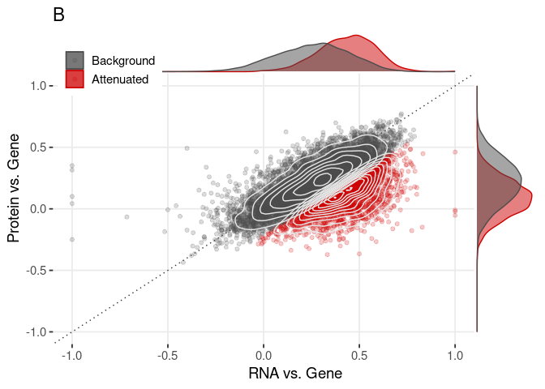
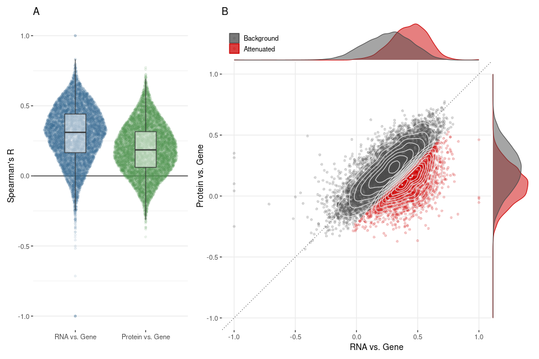

## Making figures without a mouse 🐭

In this short tutorial, we will see how to create publication-grade
figures without using a mouse: we will write the instructions for the
computer to draw the figures.

### Objectives

After this mini-workshop, you should:

-   have a basic understanding of a workflow that can build figures
    computationally

-   be able to reproduce the examples on your own data

-   find help if you want to make new figures

Before you can use this independently in your research, you will need
to:

-   learn how to import, tidy, and process data

-   learn how to troubleshoot your work

-   practice and keep learning

### Want to learn more?

This tutorial is a very brief introduction to some powerful tools for
data science. Here are a few resources that you might find useful:

-   [Fundamentals of Data Visualization](clauswilke.com/dataviz) and
    [Data Visualization - A practical
    introduction](socviz.co/index.html), excellent books providing
    fundamental knowledge on data visualization. [Graphic methods for
    presenting
    facts](https://archive.org/details/graphicmethodsfo00brinrich/mode/1up?view=theater),
    a reference book on data visualization.

-   [R for data science](r4ds.hadley.nz), a book on how to import, tidy,
    transform, visualize, and model data using the tools that we
    introduce in this workshop.

-   [Open Science, Open Data, Open Source](osodos.org), OSODOS, a book
    providing an overview over developments in open science.

-   Resources on [scientific color palettes](fabiocrameri.ch/colourmaps)
    and [color perception
    simulation](color-blindness.com/coblis-color-blindness-simulator).

-   [Weird but sometimes useful charts](xeno.graphics) to get some
    ideas.

### Before the workshop…

In order to get started quickly on the day we run this tutorial, please
do the following steps - it should only take a few minutes. If you
encounter issues, no problem, we can discuss them at the beginning of
the workshop.

📝 Open [Krug et al., doi:
10.1016/j.cell.2020.10.036](https://doi.org/10.1016/j.cell.2020.10.036)
and look at the figures. *Would you be able to make such figures for one
of your papers?*

📝 Install the latest version of RStudio. Note that you will be asked to
install R first.

📝 Optional but recommended: create an account at [GithHub](github.com)
and [OpenAI](chat.openai.com).

📝 Prepare two sets of data where you have done figures or are planning
to do so: (1) one data set with values from different categories,
e.g. values in different conditions; (2) one data set with one value to
plot against the other, e.g. height and weight of individuals.

💡 Good file organization and naming can be a life saver, especially if
you need to look up or change a figure after some time and in a
stressful situation: a paper revision, the end of your PhD… Make sure to
organize files in a clear folder organization, and use meaningful names.
More on this in
[OSODOS](https://pfern.github.io/OSODOS/gitbook/WORKFLOWS).

📝 Take your plots or make them using your favorite software and arrange
them as a panel A and B as you would do for a publication.

💬 How much did you use your mouse? What are the pros and cons of this
approach?

### Download to your computer

This tutorial is made as a
[notebook](https://en.wikipedia.org/wiki/Notebook_interface), a
convenient way to process and plot data, while at the same time
documenting what you do in a single document. Everything is stored
online in [GitHub](https://github.com/mvaudel/tutorials), where you can
freely access and navigate code. The project is version-controlled using
[git](https://en.wikipedia.org/wiki/Git), which means that you can track
changes, have multiple versions on your computer, and revert to older
versions, which is an essential component of [good practices in
scientific data
handling](https://pfern.github.io/OSODOS/gitbook/VERSIONING/).

📝 Open RStudio. Click on *File* -\> *New Project…*, Select *Version
Control* -\> *Git*. As Repository URL paste
`https://github.com/mvaudel/tutorials.git`. Use the *Browse* button to
select where to download the files, and click *Create Project*.

📝 In the tab called Files open the folder `simple_figures` and open the
file named `simple_figures.qmd`. You should now see the text of the
tutorial.

### Install packages

Many packages are available for data science in different programming
languages. In general, there is no one-size-fits-all package or
pipeline, so it is very convenient to be able to pick and choose based
on the requirements of a specific project.

📝 To install the packages needed for this tutorial on your computer,
click on the arrow in the code cell below.

``` r
if (!"tidyverse" %in% installed.packages()) { # Skip if the package is already installed
  
  install.packages("tidyverse") # A set of package to handle and plot data
  
}
if (!"ggforce" %in% installed.packages()) {
  
  install.packages("ggforce")   # A package containing functions to create custom plots
  
}
if (!"ggside" %in% installed.packages()) {
  
  install.packages("ggside")    # A package to make side plots
  
}
if (!"scico" %in% installed.packages()) {
  
  install.packages("scico")     # A package with scientific color palettes
  
}
if (!"patchwork" %in% installed.packages()) {
  
  install.packages("patchwork") # A package to asemble plots in a figure
  
}
```

### Load packages

Now that the packages are installed, you can load them.

``` r
library("tidyverse") # A set of package to handle and plot data
```

    ── Attaching core tidyverse packages ──────────────────────── tidyverse 2.0.0 ──
    ✔ dplyr     1.1.2     ✔ readr     2.1.4
    ✔ forcats   1.0.0     ✔ stringr   1.5.0
    ✔ ggplot2   3.4.1     ✔ tibble    3.2.1
    ✔ lubridate 1.9.2     ✔ tidyr     1.3.0
    ✔ purrr     1.0.1     
    ── Conflicts ────────────────────────────────────────── tidyverse_conflicts() ──
    ✖ dplyr::filter() masks stats::filter()
    ✖ dplyr::lag()    masks stats::lag()
    ℹ Use the ]8;;http://conflicted.r-lib.org/conflicted package]8;; to force all conflicts to become errors

``` r
library("ggforce")   # A package containing functions to create custom plots
library("ggside")    # A package to make side plots
```

    Registered S3 method overwritten by 'ggside':
      method from   
      +.gg   ggplot2

``` r
library("scico")     # A package with scientific color palettes
library("patchwork") # A package to asemble plots in a figure
```

### Values in categories

In this section, we will plot values that are in different categories.

#### Load data

The data we are going to plot are gene vs. RNA vs. Protein abundance
correlation values obtained from multiple cancer cell lines by [Krug et
al., doi:
10.1016/j.cell.2020.10.036](https://doi.org/10.1016/j.cell.2020.10.036).

Note that the data has been imported from the supplementary files and
put in a single table. You can see how the data were processed in the
script named [data_preparation.R](data_preparation.R) in this folder,
but for the sake of time we will not dive into data import, cleaning,
and processing for this tutorial.

``` r
correlation_table = read.table(
  file = "resources/correlation.gz",
  header = T,
  sep = "\t"
)
```

The table should now appear under the Environment tab, and if you click
on it you will be able to inspect its content.

💬 *Is it not strange to have all correlation values in a single column,
instead of making one column for CNA vs. RNA, and one for RNA
vs. Protein?*

#### Plot the correlation distributions

A simple way to compare the correlation values between these two
categories would be to make a box plot.

``` r
ggplot() +
  geom_boxplot(
    data = correlation_table,
    mapping = aes(
      x = comparison,
      y = r,
      fill = comparison
    ),
    alpha = 0.8
  )
```


To have a finer view at the distribution of points, one often makes
violin plots. Note how easy it is to switch between geometries.

``` r
ggplot() +
  geom_violin(
    data = correlation_table,
    mapping = aes(
      x = comparison,
      y = r,
      fill = comparison
    ),
    alpha = 0.8
  )
```


These summary statistics [can hide important
details](https://nightingaledvs.com/ive-stopped-using-box-plots-should-you/).
An interesting trade-off is the [sina
plot](https://clauswilke.com/dataviz/boxplots-violins.html#fig:lincoln-temp-sina),
which shows the individual points with the jitter following the density.

``` r
ggplot() +
  geom_sina(
    data = correlation_table,
    mapping = aes(
      x = comparison,
      y = r,
      col = comparison
    ),
    alpha = 0.1
  )
```


You can easily overlay the different geometries, e.g. to combine the
sina and box plots.

``` r
ggplot() +
  geom_sina(
    data = correlation_table,
    mapping = aes(
      x = comparison,
      y = r,
      col = comparison
    ),
    alpha = 0.1
  ) +
  geom_boxplot(
    data = correlation_table,
    mapping = aes(
      x = comparison,
      y = r,
      fill = comparison
    ),
    alpha = 0.8,
    width = 0.3,
    outlier.colour = NA
  )
```



Before showing such a plot to your colleagues, you might want to change
a few things: the order of the categories, the labels, the colors, etc.

``` r
correlation_table$comparison = factor(correlation_table$comparison, levels = c("r_cna_rna", "r_cna_protein"))

levels(correlation_table$comparison) = c("RNA vs. Gene", "Protein vs. Gene")

plot_distributions = ggplot() +
  theme_bw(
    base_size = 14
  ) +
  geom_hline(
    yintercept = 0
  ) +
  geom_sina(
    data = correlation_table,
    mapping = aes(
      x = comparison,
      y = r,
      col = comparison
    ),
    alpha = 0.1
  ) +
  geom_boxplot(
    data = correlation_table,
    mapping = aes(
      x = comparison,
      y = r,
      group = comparison
    ),
    alpha = 0.5,
    width = 0.3,
    outlier.colour = NA
  ) +
  scale_color_manual(
    values = scico(
      n = 2,
      begin = 0.2,
      end = 0.8,
      palette = "cork"
    )
  ) +
  scale_y_continuous(
    name = "Spearman's R"
  ) +
  theme(
    axis.title.x = element_blank(),
    panel.grid.major.x = element_blank(),
    panel.grid.minor.x = element_blank(),
    panel.border = element_blank(),
    legend.position = "none"
  ) +
  ggtitle(
    label = "A"
  )

plot(plot_distributions) # Note that the syntax changed a bit here, we saved the plot as an object andto reuse it later on
```



### Values against a continuous variable

In this section, we will plot values against a continuous variable.

#### Load data

We will continue to use the correlation values from [Krug et al., doi:
10.1016/j.cell.2020.10.036](https://doi.org/10.1016/j.cell.2020.10.036)
and plot them as done by [Gonçalves et
al.](https://pubmed.ncbi.nlm.nih.gov/29032074/) and [Johansson et
al.](https://www.nature.com/articles/s41467-019-09018-y).



Here again, the data have been processed for you.

``` r
attenuation_table = read.table(
  file = "resources/attenuation.gz",
  header = T,
  sep = "\t"
)
```

#### Plot the correlation values

This table provides a correlation coefficient for every protein
abundance with gene copy number and RNA abundance estimate, we will plot
one against the other.

``` r
ggplot(
    data = attenuation_table
) +
    geom_abline(
        slope = 1,
        intercept = 0,
        linetype = "dotted",
        col = "black",
        alpha = 0.8
    ) +
    geom_point(
        mapping = aes(
            x = r_cna_rna,
            y = r_cna_protein
        ),
        col = "black",
        alpha = 0.2
    ) +
    scale_x_continuous(
        name = "RNA vs. Gene",
        limits = c(-1, 1)
    ) +
    scale_y_continuous(
        name = "Protein vs. Gene",
        limits = c(-1, 1)
    )
```



Note that in their figure, Gonçalves et al. show the density of points
with level lines, and it nicely helps seeing where points are
distributed in such a crowded plot.

``` r
ggplot(
    data = attenuation_table
) +
    geom_abline(
        slope = 1,
        intercept = 0,
        linetype = "dotted",
        col = "black",
        alpha = 0.8
    ) +
    geom_point(
        mapping = aes(
            x = r_cna_rna,
            y = r_cna_protein
        ),
        col = "black",
        alpha = 0.2
    ) +
    geom_density2d(
        mapping = aes(
            x = r_cna_rna,
            y = r_cna_protein
        ),
        col = "grey90"
    ) +
    scale_x_continuous(
        name = "RNA vs. Gene",
        limits = c(-1, 1)
    ) +
    scale_y_continuous(
        name = "Protein vs. Gene",
        limits = c(-1, 1)
    )
```



As you can see, some proteins are along the diagonal, while others fall
below, this phenomenon is called post-transcriptional attenuation of
genomic copy-number variation by [Gonçalves et
al.](https://pubmed.ncbi.nlm.nih.gov/29032074/). Proteins are then
classified proteins on whether they are attenuated or not.

``` r
table(attenuation_table$attenuation_category)
```


    Attenuated Background 
          2248       7199 

We can color the points according to the attenuation category.

``` r
ggplot(
    data = attenuation_table
) +
    geom_abline(
        slope = 1,
        intercept = 0,
        linetype = "dotted",
        col = "black",
        alpha = 0.8
    ) +
    geom_point(
        mapping = aes(
            x = r_cna_rna,
            y = r_cna_protein,
            col = attenuation_category
        ),
        alpha = 0.2
    ) +
    geom_density2d(
        mapping = aes(
            x = r_cna_rna,
            y = r_cna_protein,
            group = attenuation_category
        ),
        col = "grey90"
    ) +
    scale_x_continuous(
        name = "RNA vs. Gene",
        limits = c(-1, 1)
    ) +
    scale_y_continuous(
        name = "Protein vs. Gene",
        limits = c(-1, 1)
    ) +
  scale_color_manual(
    values = c("red3", "grey30")
  ) +
  theme(
    legend.justification = c(0, 1), 
    legend.position = c(0.01, 0.99),
    legend.title = element_blank(),
    legend.background = element_rect(
      fill = "grey99"
    )
  ) +
  guides(
    colour = guide_legend(
      reverse=T
      )
    )
```


In their publication, [Gonçalves et
al.](https://pubmed.ncbi.nlm.nih.gov/29032074/) add densities on the
side of the plots to show the distribution of values for the different
categories of points, which greatly helps the interpretation. We can do
the same with the [ggside](https://github.com/jtlandis/ggside) package,
which offers many options to complement your plots with side plots.

``` r
plot_values <- ggplot(
  data = attenuation_table
) +
  theme_bw(
    base_size = 14
  ) +
  geom_abline(
    slope = 1,
    intercept = 0,
    linetype = "dotted",
    col = "black",
    alpha = 0.8
  ) +
  geom_point(
    mapping = aes(
      x = r_cna_rna,
      y = r_cna_protein,
      col = attenuation_category
    ),
    alpha = 0.2
  ) +
  geom_density2d(
    mapping = aes(
      x = r_cna_rna,
      y = r_cna_protein,
      group = attenuation_category
    ),
    col = "grey90"
  ) +
  geom_xsidedensity(
    mapping = aes(
      x = r_cna_rna,
      y = after_stat(density),
      col = attenuation_category,
      fill = attenuation_category
    ),
    alpha = 0.5
  ) +
  geom_ysidedensity(
    mapping = aes(
      x = after_stat(density),
      y = r_cna_protein,
      col = attenuation_category,
      fill = attenuation_category
    ),
    alpha = 0.5
  ) +
  scale_x_continuous(
    name = "RNA vs. Gene",
    limits = c(-1, 1)
  ) +
  scale_xsidey_continuous(
    limits = c(0, 2.7)
  ) +
  scale_y_continuous(
    name = "Protein vs. Gene",
    limits = c(-1, 1)
  ) +
  scale_ysidex_continuous(
    limits = c(0, 2.7)
  ) +
  scale_color_manual(
    values = c("red3", "grey30")
  ) +
  scale_fill_manual(
    values = c("red3", "grey30")
  ) +
  theme(
    legend.justification = c(0, 1), 
    legend.position = c(0.01, 0.99),
    legend.title = element_blank(),
    ggside.panel.scale = 0.15,
    ggside.axis.ticks = element_blank(),
    ggside.axis.text = element_blank(),
    ggside.panel.grid = element_blank(),
    ggside.panel.background = element_blank(),
    panel.border = element_blank(),
    panel.grid.minor = element_blank(),
    ggside.panel.spacing = unit(0, "pt")
  ) +
  guides(
    colour = guide_legend(
      reverse=T
    ),
    fill = guide_legend(
      reverse=T
    )
  ) +
  ggtitle(
    "B"
  )

plot(plot_values)
```



### Assemble into a single figure

Once you have all your panels designed the way you want, you can
assemble them into a multi-panel figure using the
[patchwork](patchwork.data-imaginist.com/) package.

``` r
assembled_plot = plot_distributions + plot_values + plot_layout(widths = c(1, 2))

# This time we save the figure for inclusion to our paper
png(
  filename = "figure_for_paper.png",
  width = 900,
  height = 600
)
assembled_plot
device <- dev.off()
```


