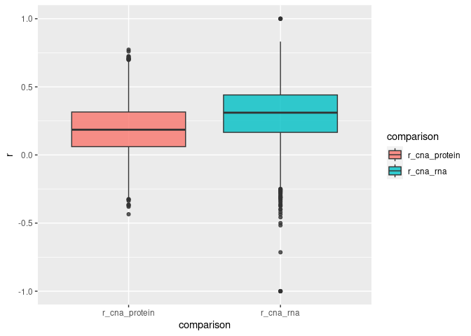
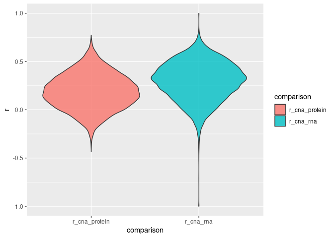

## *Simple figures*

*In this short tutorial, we will see how to create publication-grade
figures without using a mouse: we will write the instructions for the
computer to draw the figures.*

### *Objectives*

*After this mini-workshop, you should:*

-   *have a basic understanding of a workflow that can build figures
    computationally*

-   *be able to reproduce the examples on your own data*

-   *find help if you want to make new figures*

*Before you can use this independently in your research, you will need
to:*

-   *learn how to import, tidy, and process data*

-   *learn how to troubleshoot your work*

-   *practice and keep learning*

### *Want to learn more?*

*This tutorial is a very brief introduction to some powerful tools for
data science. Here are a few resources that you might find useful:*

-   [*Fundamentals of Data Visualization*](clauswilke.com/dataviz) *and
    [Data Visualization - A practical
    introduction](socviz.co/index.html), excellent books providing
    fundamental knowledge on data visualization. [Graphic methods for
    presenting
    facts](https://archive.org/details/graphicmethodsfo00brinrich/mode/1up?view=theater),
    a reference book on data visualization Willard c. Brinton.*

-   [*R for data science*](r4ds.hadley.nz)*, a book on how to import,
    tidy, transform, visualize, and model data using the tools that we
    introduce in this workshop.*

-   [*Open Science, Open Data, Open Source*](osodos.org)*, OSODOS, a
    book providing an overview over developments in open science.*

-   *Resources on [scientific color
    palettes](fabiocrameri.ch/colourmaps) and [color perception
    simulation](color-blindness.com/coblis-color-blindness-simulator).*

-   [*Weird but sometimes useful charts*](xeno.graphics) *to get some
    ideas.*

### *Before the workshop…*

*In order to get started quickly on the day we run this tutorial, please
do the following steps - it should only take a few minutes. If you
encounter issues, no problem, we can discuss them at the beginning of
the workshop.*

*📝 Open [Krug et al., doi:
10.1016/j.cell.2020.10.036](https://doi.org/10.1016/j.cell.2020.10.036)
and look at the figures. Would you be able to make such figures for one
of your papers?*

*📝 Install the latest version of RStudio
\[link\](posit.co/download/rstudio-desktop/). Note that you will be
asked to install R first.*

*📝 Optional but recommended: create an account at [GithHub](github.com)
and [OpenAI](chat.openai.com).*

*📝 Prepare two sets of data: (1) one data set with values from
different categories, e.g. values in different conditions; (2) one data
set with one value to plot against the other, e.g. height and weight of
individuals.*

*💡 Good file organization and naming can be a life saver, especially if
you need to look up or change a figure after some time and in a
stressful situation: a paper revision, the end of your PhD… Make sure to
organize files in a clear folder organization, and use meaningful names.
More on this in
[OSODOS](https://pfern.github.io/OSODOS/gitbook/WORKFLOWS).*

*📝 Make the plots the way you are used to using your favorite software
and arrange them as a panel A and B for a publication.*

*💬 How much did you use your mouse? What are the pros and cons of this
approach?*

### *Download to your computer*

*This tutorial is made as a
[notebook](https://en.wikipedia.org/wiki/Notebook_interface), a
convenient way to process and plot data, while at the same time
documenting what you do in a single document. Everything is stored
online in [GitHub](https://github.com/mvaudel/tutorials), where you can
freely access and navigate code. The project is version-controlled using
[git](https://en.wikipedia.org/wiki/Git), which means that you can track
changes, have multiple versions on your computer, and revert to older
versions, which is an essential component of [good practices in
scientific data
handling](https://pfern.github.io/OSODOS/gitbook/VERSIONING/).*

*📝 Open RStudio. Click on File -\> New Project…, Select Version Control
-\> Git. As Repository URL paste
`https://github.com/mvaudel/tutorials.git`. Use the Browse button to
select where to download the files, and click Create Project.*

*📝 In the tab called Files open the folder simple_figures and open the
file named simple_figures.qmd. You should now see the text of the
tutorial.*

### *Install packages*

*Many packages are available for data science in different programming
languages. In general, there is no one-size-fits-all package or
pipeline, so it is very convenient to be able to pick and choose based
on the requirements of a specific project.*

*📝 To install the packages needed for this tutorial on your computer,
click on the arrow in the code cell below.*

``` r
if (!"tidyverse" %in% installed.packages()) { # Skip if the package is already installed
  
  install.packages("tidyverse") # A set of package to handle and plot data
  
}
if (!"ggforce" %in% installed.packages()) {
  
  install.packages("ggforce")   # A package containing functions to create custom plots
  
}
if (!"scico" %in% installed.packages()) {
  
  install.packages("scico")   # A package containing functions to create custom plots
  
}
```

### *Load packages*

*Now that the packages are installed, you can load them.*

``` r
library("tidyverse") # A set of package to handle and plot data
```

    ── Attaching core tidyverse packages ──────────────────────── tidyverse 2.0.0 ──
    ✔ dplyr     1.1.2     ✔ readr     2.1.4
    ✔ forcats   1.0.0     ✔ stringr   1.5.0
    ✔ ggplot2   3.4.1     ✔ tibble    3.2.1
    ✔ lubridate 1.9.2     ✔ tidyr     1.3.0
    ✔ purrr     1.0.1     
    ── Conflicts ────────────────────────────────────────── tidyverse_conflicts() ──
    ✖ dplyr::filter() masks stats::filter()
    ✖ dplyr::lag()    masks stats::lag()
    ℹ Use the ]8;;http://conflicted.r-lib.org/conflicted package]8;; to force all conflicts to become errors

``` r
library("ggforce")   # A package containing functions to create custom plots
library("scico")     # A package with scientific color palettes
```

### *Values in categories*

*In this section, we will plot values that are in different categories.*

#### *Load data*

*The data we are going to plot are gene vs. RNA vs. Protein abundance
correlation values obtained from multiple cancer cell lines by [Krug et
al., doi:
10.1016/j.cell.2020.10.036](https://doi.org/10.1016/j.cell.2020.10.036).*

*Note that for the sake of time, the data has been imported from the
supplementary files and put in a single table. You can see how in the
script named [data_preparation.R](data_preparation.R) in this folder.*

``` r
correlation_table = read.table(
  file = "resources/correlation.gz",
  header = T,
  sep = "\t"
)
```

*The table should now appear under the Environment tab, and if you click
on it you will be able to inspect its content.*

*💬 Is it not strange to have all correlation values in a single column,
instead of making one column for CNA vs. RNA, and one for RNA
vs. Protein?*

#### *Plot the correlation values*

*A simple way to compare the correlation values between these two
categories would be to make a box plot.*

``` r
ggplot() +
  geom_boxplot(
    data = correlation_table,
    mapping = aes(
      x = comparison,
      y = r,
      fill = comparison
    ),
    alpha = 0.8
  )
```



*To have a finer view at the distribution of points, one often makes
violin plots. Note how easy it is to switch between geometries.*

``` r
ggplot() +
  geom_violin(
    data = correlation_table,
    mapping = aes(
      x = comparison,
      y = r,
      fill = comparison
    ),
    alpha = 0.8
  )
```



*These summary statistics [can hide important
details](https://nightingaledvs.com/ive-stopped-using-box-plots-should-you/).
An interesting trade-off is the [sina
plot](https://clauswilke.com/dataviz/boxplots-violins.html#fig:lincoln-temp-sina),
which shows the individual points with the jitter following the
density.*

``` r
ggplot() +
  geom_sina(
    data = correlation_table,
    mapping = aes(
      x = comparison,
      y = r,
      col = comparison
    ),
    alpha = 0.1
  )
```


*You can easily overlay the different geometries, e.g. to combine the
sina and box plots.*

``` r
ggplot() +
  geom_sina(
    data = correlation_table,
    mapping = aes(
      x = comparison,
      y = r,
      col = comparison
    ),
    alpha = 0.1
  ) +
  geom_boxplot(
    data = correlation_table,
    mapping = aes(
      x = comparison,
      y = r,
      fill = comparison
    ),
    alpha = 0.8,
    width = 0.3,
    outlier.colour = NA
  )
```


*Before showing such a plot to your colleagues, you might want to change
a few things: the order of the categories, the labels, the colors, etc.*

``` r
correlation_table$comparison = factor(correlation_table$comparison, levels = c("r_cna_rna", "r_cna_protein"))

levels(correlation_table$comparison) = c("RNA vs. Gene", "Protein vs. Gene")

ggplot() +
  theme_bw(
    base_size = 14
  ) +
  geom_hline(
    yintercept = 0
  ) +
  geom_sina(
    data = correlation_table,
    mapping = aes(
      x = comparison,
      y = r,
      col = comparison
    ),
    alpha = 0.1
  ) +
  geom_boxplot(
    data = correlation_table,
    mapping = aes(
      x = comparison,
      y = r,
      fill = comparison
    ),
    alpha = 0.8,
    width = 0.3,
    outlier.colour = NA
  ) +
  scale_y_continuous(
    name = "Spearman's R"
  ) +
  theme(
    axis.title.x = element_blank(),
    panel.grid.major.x = element_blank(),
    panel.grid.minor.x = element_blank(),
    panel.border = element_blank(),
    legend.position = "none"
  )
```


